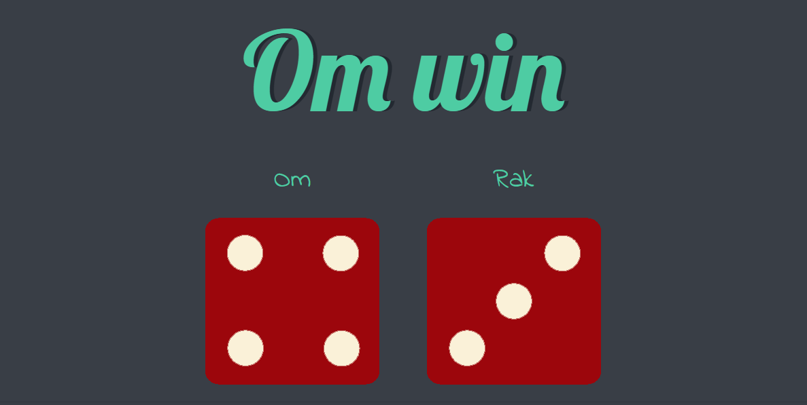

# 🎲 Dicee Roll Game

A simple web-based dice game where two players roll dice, and the higher number wins! Built using **HTML**, **CSS**, **JavaScript** & **Bootstrap**.

---

## 🚀 Live Demo

🔗 [Click here to play](https://rakmo5.github.io/Dice-Roll-toss/)

## 📸 Screenshot

## 🎮 Features

- Two-player dice roll
- Random dice images generated using JavaScript
- Displays winner based on roll
- Prompts for player names
- Responsive design (optional improvement)

---

## 🛠️ Tech Stack

- HTML
- CSS
- JavaScript
- bootstrap 
- Hosted with GitHub Pages

---

## 📂 Folder Structure

📁 dicee-game/
├── index.html
├── index.js
├── style.css
├── images/
│ ├── dice1.png
│ ├── dice2.png
│ ├── ...
│ └── eg.png
└── README.md

---

## 💡 Future Ideas

- Add sound effects
- Show roll history
- Add animation to dice rolls
- Support mobile responsiveness

---

## 🙌 Author

Made with ❤️ by Omkar Tilekar, as part of the [The Complete 2024 Web Development Bootcamp](https://www.udemy.com/course/the-complete-web-development-bootcamp/) by Dr. Angela Yu.
